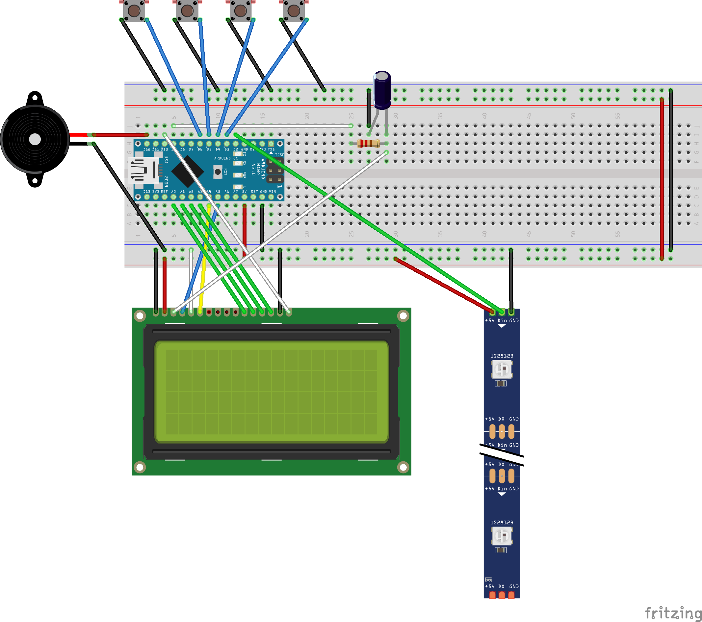

# MultiCyclone
## An Arduino implementation of the Cyclotron arcade game for 1 to 4 player.

### Objective of the game
You are scientists analysing particles sent across an acceleration chamber. To do this each scientist has a particle gun. To create a collision between your particle and the particle in the acceleration chamber you must hit the launch button at the exact moment the particle is in front of your particle gun. Every succesfull collision accellerates the particle. If the particle travels the chamber five times without a succesfull collision the particle is lost and the game ends. The scientist with the most succesfull collisions wins the game.

There can be up to four players, with colors Red, Blue, Green and Yellow. Each active player has the location of the particle gun indicated by his/her color on the LED strip.

### Bill of Materials
* 1pc Arduino Nano (or similar)
* 1pc 60 LED WS2812 strip (for the optimal Cyclotron experience this should be positioned in a circle, like for instance the Adafruit Neopixel 1/4 60 LED ring)
* 4pc pushbuttons (preferably big arcade style ones)
* 1pc Piezo buzzer
* 1pc 20x4 LCD
* 1pc resistor 1k
* 1pc electric capacitor 10uF

### How to build

